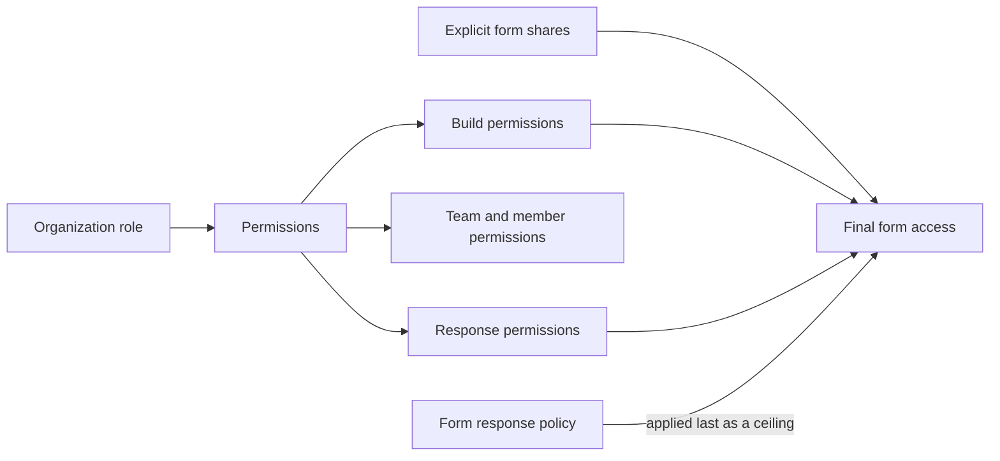
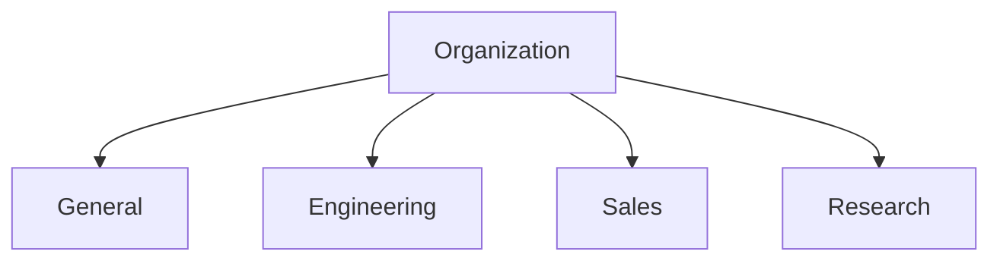
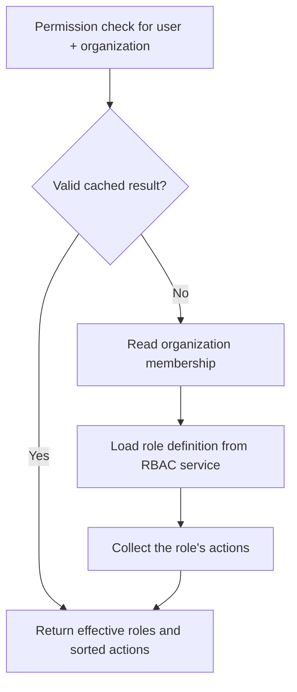
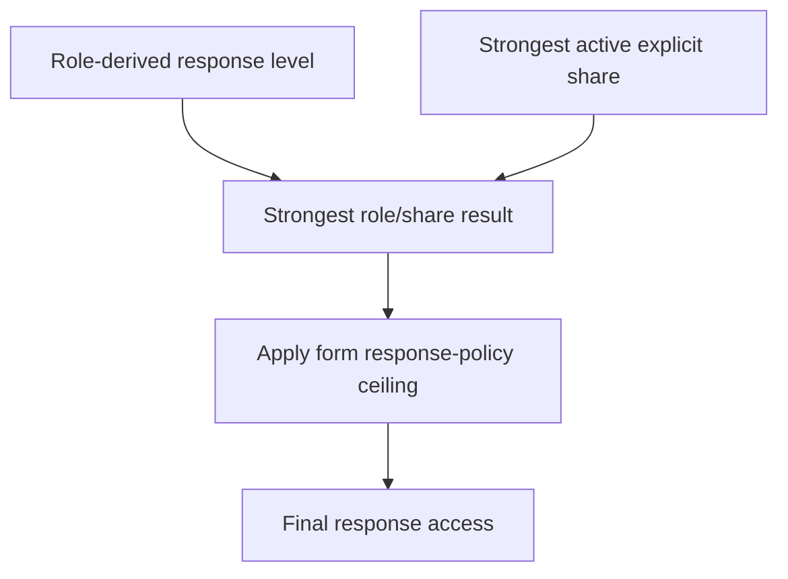

# SifyForms teams, roles, and permissions

_Last verified against the application code on 31 August 2026._

This guide explains the **current implementation**, not a future proposal. It is intended for product owners, administrators, support teams, developers, and testers who need to understand why a person can—or cannot—see or change something.

The diagrams use Mermaid. GitHub renders them as visual diagrams directly in this document, so separate screenshot images are not required and the diagrams stay accurate when the code changes.

---

## 1. The short version

SifyForms access is built from three ideas:

1. Every person has **one organization role** in each organization they join.
2. That organization role is the **single source of a person's permissions** across the whole organization.
3. Teams are **flat organizational buckets** — they group forms and act as targets for per-form sharing, but they carry **no permissions of their own**.

A person's access to a form is:

- their **organization role**, plus
- any **explicit form shares** granted to them or to a team they belong to,
- capped last by the form's **response policy**.



> Important: team membership is purely organizational. Being on a team never grants, restricts, or changes a person's permissions — it only determines grouping and which team shares reach them.

---

## 2. Terminology

| Term | Meaning |
|---|---|
| Organization | The top-level workspace containing members, teams, forms, and invitations. |
| Organization member | A person who has accepted membership in an organization. |
| Organization role | The person’s single role across that organization. Stored on the organization membership (`OrgUser.role`). |
| Team | A flat organizational bucket that groups forms. Teams have no hierarchy. |
| Team membership | A pure join between a person and a team (`TeamMember`). It carries no role. |
| Owning team | The team a form is grouped under (`Form.teamId`). It does not grant access by itself. |
| Role definition | The list of actions granted by a role name. Definitions come from the RBAC service. |
| Role assignment | The record saying which role a person holds at organization scope. Assignments are stored by the Form Builder backend. |
| Effective permissions | The actions granted by a person’s organization role. |
| Response policy | A form-level privacy ceiling that can restrict response visibility even when a role grants more. |
| Explicit share | Access granted directly to a user or team for one form. |

---

## 3. Organization membership lifecycle

A person must belong to an organization before they can be added to one of its teams.


### Current invitation behavior

- Invitations are addressed to a normalized email address.
- Pending invitations appear in the invitee’s organization chooser after sign-in.
- Re-inviting an existing pending address reuses the invitation record.
- Accepting an invitation creates the organization membership using the invitation role.
- A user already in the organization cannot be invited again.
- Revoking is allowed only while an invitation is pending.
- The current stack delivers invitations **in the application**, not by email.

### Organization safety rules

- The organization owner cannot be removed.
- The owner must retain the Owner role.
- The backend prevents removing or demoting the last remaining administrator.
- Removing a person from the organization also removes all of their team memberships in that organization.

---

## 4. How teams work

Teams are **flat**: there is no parent/child relationship, no nesting, and no hierarchy. Every team sits directly under the organization.

Every organization starts with a protected team named **General**.

- Forms created without an explicit team are assigned to General.
- General cannot be deleted.
- The organization owner is added to General when the organization is created.



### Creating and deleting teams

- Team names are converted to organization-unique slugs.
- A team may be renamed; renaming does not change its slug.
- Deleting a team does **not** delete its forms — forms are re-homed to General so business data survives team restructuring.
- The General team cannot be deleted.
- Team memberships are deleted with their team records.

---

## 5. One role per person, organization-wide

A person holds exactly one organization role, and that role applies uniformly across every team.

There is no team-level role and no role inheritance. Adding someone to a team does not change what they can do anywhere.

| Scope | Assignment |
|---|---|
| Organization | Viewer |

In this example the person is a Viewer for the **entire organization** — on every team and every form — unless a form is explicitly shared with them.

---

## 6. Organization roles

Role definitions are organization-scoped only. There is no team scope and no `TEAM_LEAD` role.

### Built-in roles

| Role | Default purpose | Build forms | Individual responses | Administration |
|---|---|---|---|---|
| Owner | Full organization control | Full | Full + export | Includes billing and organization deletion |
| Admin | Day-to-day organization administration | Full | Full + export | Cannot manage billing or delete the organization by default |
| Creator | Builds and publishes forms | Create, edit, delete, publish | Aggregate results only | No organization administration |
| Analyst | Reviews response data | View forms only | Full + export | No form editing or organization administration |
| Viewer | Discovers available forms | View forms only | None | No administration |

### Why build access and response access are separate

The application deliberately separates:

- **Build plane:** create, edit, publish, move, share, or delete forms
- **Response plane:** aggregate, redacted, full, export, or delete responses
- **Administration plane:** organization, member, team, role, and billing operations

A form creator often should not automatically read sensitive individual answers. The default Creator role therefore receives aggregate results rather than full response rows.

---

## 7. Custom roles

An authorized administrator can create a role by choosing:

1. A name and description
2. Actions grouped under Organization, Team, Form, and Response

Current constraints:

- Role names are 2–49 characters using letters, numbers, spaces, hyphens, or underscores.
- A role needs at least one permission.
- Role names are case-insensitively unique.
- Built-in roles cannot be renamed or retired, but their permissions can be edited.
- A custom role cannot be retired while assignments still reference it.
- Retired roles disappear from assignment pickers; they are not deleted.

### Important current architecture limitation

Role definitions live in the external RBAC service and are shared for the Form Builder application. They are **not currently owned by one organization**. A custom role created from one organization can therefore appear in another organization using the same RBAC application.

Role assignments remain organization-specific. Supporting truly organization-private custom role definitions requires either RBAC-service ownership support or a local organization-role-definition table.

---

## 8. Effective permission resolution



Effective permission results are cached by user and organization. The default cache duration is:

```env
RBAC_CACHE_TTL_MS=30000
```

Membership and role changes invalidate relevant cached decisions. Editing a role definition clears the complete permission cache because that definition may be assigned in many organizations.

If a membership references an unknown role definition, that role contributes no actions and a warning is logged.

---

## 9. How form access is determined

Every form has a `teamId` for grouping. Access to a form is resolved in this order:

1. **Organization role** — the person’s single role, applied the same way on every form.
2. **Explicit shares** — a grant on this one form to a user, or to a team the user belongs to. Shares can only add access.
3. **Response policy** — applied last as a ceiling, so a privacy promise cannot be bypassed.

A user can reach forms belonging to:

- Any team, when their organization role includes form-viewing actions
- Teams where they have a direct membership (for the team-filtered lists)
- Forms explicitly shared with them or one of their teams, subject to the route’s access rules

Moving a form to another team changes only its grouping; it does not change who can access it.

---

## 10. Response visibility is resolved separately

Role permissions are only the first step for response access.



Response levels form an ascending ladder:

1. `NONE`
2. `AGGREGATE`
3. `REDACTED`
4. `FULL`
5. `EXPORT`

A higher level includes the levels below it.

### Form policy ceilings

| Policy | Maximum role/share result | Meaning |
|---|---|---|
| Standard | Export | Normal role and sharing rules apply |
| Anonymous | Aggregate | Nobody—including Owner or Admin—can open individual responses |
| Blind review | Redacted | Individual responses are readable, but identifying fields remain masked |
| Restricted | Export, but only with an explicit share | Organization role alone does not grant response visibility |

The form policy is applied last, so a privacy promise cannot be bypassed by a powerful role.

---

## 11. UI responsibilities

### Members page

Use this page to:

- Invite someone into the organization
- Choose their organization-level role
- Change an existing organization role
- Remove an organization member
- Revoke a pending invitation

### Teams page

Use this page to:

- Create teams
- Browse the organization’s flat team list
- Select a team and inspect its members
- Add an existing organization member to that team
- Remove a team membership
- Delete a team (forms are moved to General)

Team membership never changes a person’s permissions.

### Roles page

Use this page to:

- Review live built-in and custom role definitions
- Inspect permission and assignment counts
- Create custom roles
- Edit permissions
- Retire or restore eligible custom roles

### Forms and Create Form

The selected owning team groups the new form. A person’s access to that form comes from their organization role and any shares, regardless of the team chosen.

---

## 12. Common examples

### “Why can an Analyst read every form’s responses, including teams they are not on?”

A person’s organization role applies uniformly across the whole organization. Teams group forms; they do not scope access. Use an explicit per-form share if you need narrower response access.

### “Why can a Creator build forms in teams they are not a member of?”

The Creator organization role grants build actions across the organization. Team membership is not required for, and does not limit, building.

### “Why can the Owner not open responses to an anonymous form?”

The Anonymous response policy caps everyone at Aggregate after roles and shares are resolved.

### “Why did deleting a team not delete its forms?”

Forms are intentionally moved to General so business data survives team restructuring.

### “Why is a role missing from a picker?”

Check that the role is active. Every role is organization-scoped, so any active role should appear in organization-role pickers.

### “Why did a role change not appear immediately?”

Successful membership and role writes invalidate permission caches. If an external RBAC update failed or a stale deployment is running, inspect the RBAC service and backend logs. The normal cache fallback is 30 seconds.

---

## 13. Source-of-truth files

| Concern | Primary files |
|---|---|
| Built-in roles, actions, policy ceilings | `backend/src/config/rbac.config.ts` |
| Effective permission resolution | `backend/src/service/permission.service.ts` |
| Team creation, membership, deletion | `backend/src/service/team.service.ts` |
| Role catalogue and custom role lifecycle | `backend/src/service/role.service.ts` |
| Form ownership, shares, response policy | `backend/src/service/formAccess.service.ts` |
| Organization membership and last-admin guard | `backend/src/service/org.service.ts` |
| Invitation lifecycle | `backend/src/service/invite.service.ts` |
| Frontend permission gating | `src/hooks/usePermissions.ts` |
| Members UI | `src/pages/MembersPage.tsx` |
| Teams UI | `src/pages/TeamsPage.tsx` |
| Roles UI | `src/pages/RolesPage.tsx` |

The frontend hides unavailable controls for clarity. The backend remains authoritative and checks permissions again on every protected request.

---

## 14. Administrator checklist

Before assigning a role:

1. Confirm the organization role is the right level, since it applies across the whole organization.
2. Separate the ability to build a form from the ability to read its responses.
3. Use Analyst rather than broad administration for response-only work.
4. Use explicit form shares to grant narrower access to a specific form or team.
5. Check the form’s response policy before promising access.
6. Move all holders before retiring a custom role.
7. Keep at least one organization administrator.
8. Test sensitive access with a non-admin account before publishing the workflow.
