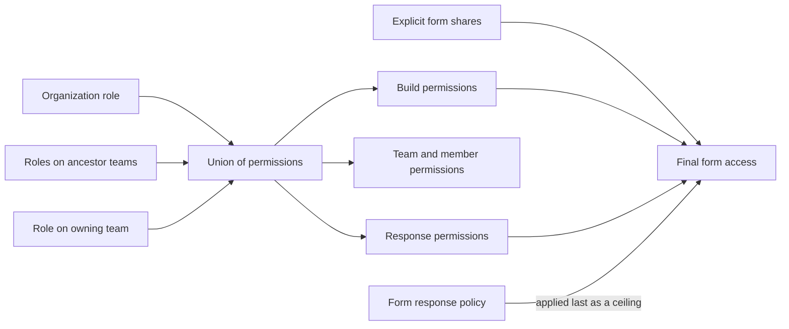
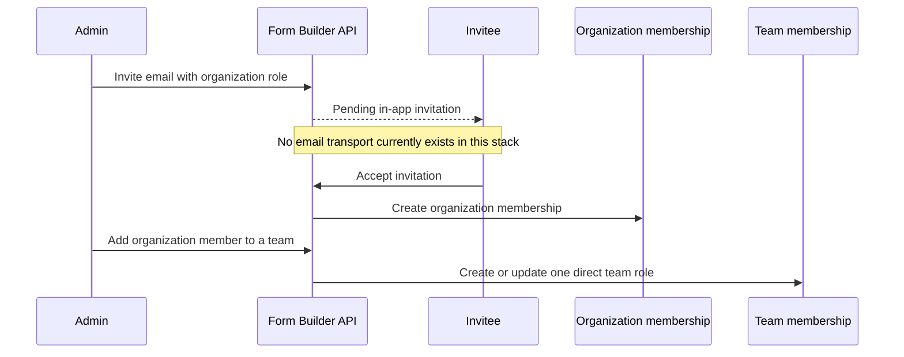
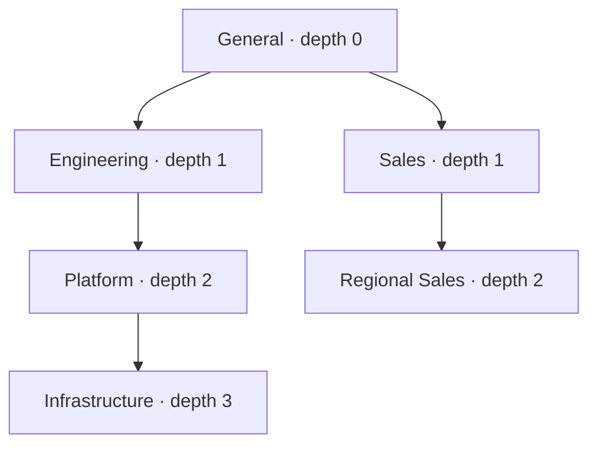
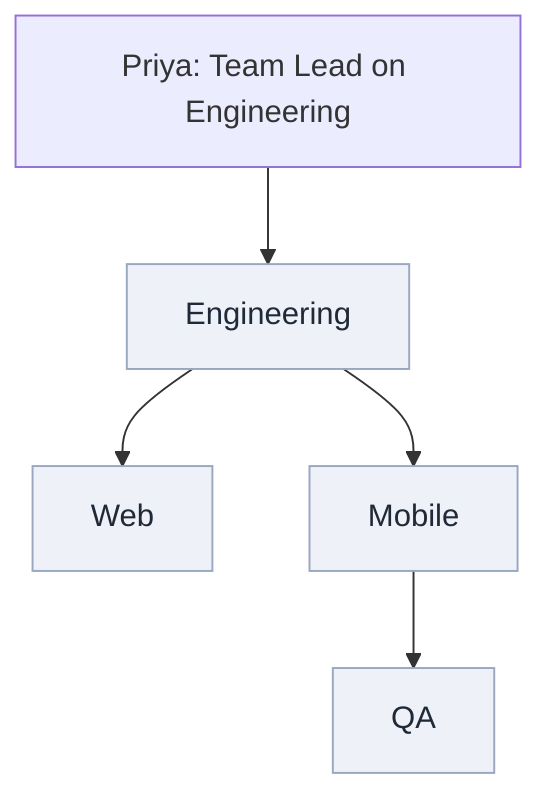
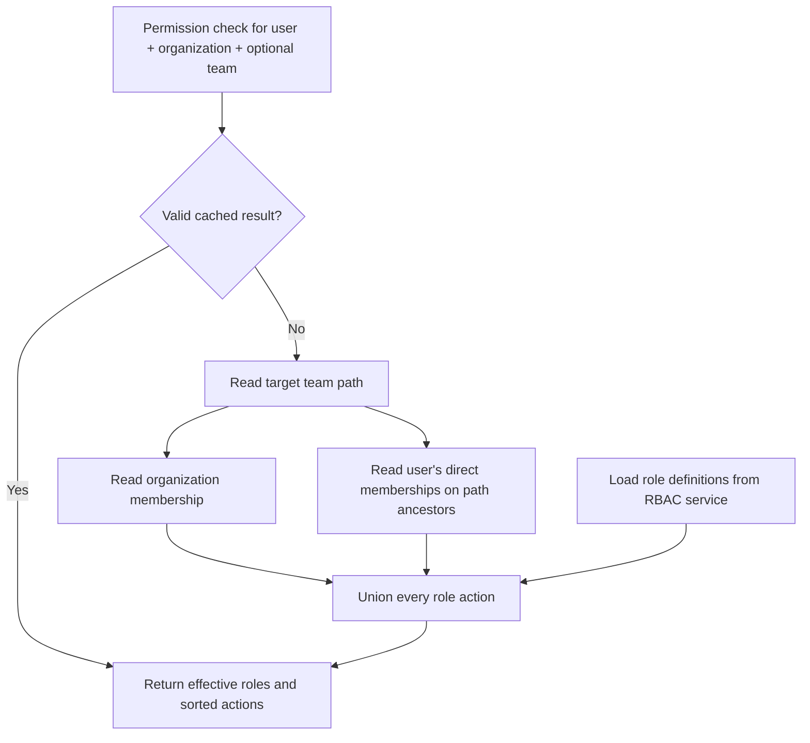
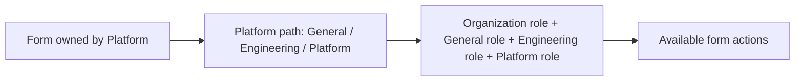
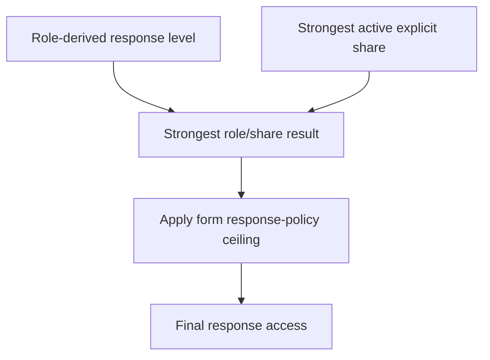

# SifyForms teams, roles, and permissions

_Last verified against the application code on 28 August 2026._

This guide explains the **current implementation**, not a future proposal. It is intended for product owners, administrators, support teams, developers, and testers who need to understand why a person can—or cannot—see or change something.

The diagrams use Mermaid. GitHub renders them as visual diagrams directly in this document, so separate screenshot images are not required and the diagrams stay accurate when the code changes.

---

## 1. The short version

SifyForms access is built from four ideas:

1. Every person has **one organization role** in each organization they join.
2. A person may also have **one direct role on each team** they are added to.
3. A team role applies to that team **and every team below it**.
4. Effective permissions are the **union** of the organization role and all applicable team roles.

Every form belongs to an owning team. That team determines which inherited team roles apply to the form.



> Important: team roles are additive in the current code. Assigning a lower-powered role on a child team does **not** remove permissions already granted by an organization role or an ancestor-team role.

---

## 2. Terminology

| Term | Meaning |
|---|---|
| Organization | The top-level workspace containing members, teams, forms, and invitations. |
| Organization member | A person who has accepted membership in an organization. |
| Organization role | The person’s default role across that organization. Stored on the organization membership. |
| Team | A node in the organization hierarchy. A team may contain sub-teams. |
| Direct team member | A person explicitly added to one team. |
| Team role | A role assigned on a team. It inherits downward to descendants. |
| Owning team | The team a form belongs to. Its ancestry is used when resolving form access. |
| Role definition | The list of actions granted by a role name. Definitions come from the RBAC service. |
| Role assignment | The record saying which role a person holds at organization or team scope. Assignments are stored by the Form Builder backend. |
| Effective permissions | The final union of actions contributed by every applicable role. |
| Response policy | A form-level privacy ceiling that can restrict response visibility even when a role grants more. |
| Explicit share | Access granted directly to a user or team for one form. |

---

## 3. Organization membership lifecycle

A person must belong to an organization before they can be added to one of its teams.



### Current invitation behavior

- Invitations are addressed to a normalized email address.
- Pending invitations appear in the invitee’s organization chooser after sign-in.
- Re-inviting an existing pending address reuses the invitation record.
- Accepting an invitation creates the organization membership using the invitation role.
- A user already in the organization cannot be invited again.
- Revoking is allowed only while an invitation is pending.
- The current stack delivers invitations **in the application**, not by email.

### Organization safety rules

- The organization owner cannot be removed.
- The owner must retain the Owner role.
- The backend prevents removing or demoting the last remaining administrator.
- Removing a person from the organization also removes all of their team memberships in that organization.

---

## 4. How the team hierarchy works

Every organization starts with a protected root team named **General**.

- Forms created without an explicit team are assigned to General.
- General cannot be deleted.
- The organization owner is added to General as a Team Lead when the organization is created.
- A newly created team gives its creator the default Team Lead role.

### Stored hierarchy

Each team stores:

- `parentId`: its direct parent
- `path`: every ancestor ID plus its own ID, for example `/root/engineering/platform`
- `depth`: zero for a root team, then one, two, and so on

The materialized `path` lets the backend resolve ancestors and descendants without recursive database queries.



The default maximum is controlled by:

```env
MAX_TEAM_DEPTH=5
```

That means a root at depth `0` can currently have descendants through depth `5`. Deployments may change the environment value.

### Creating and deleting teams

- Team names are converted to organization-unique slugs.
- Parent teams must belong to the same organization.
- Renaming a team does not change its slug or materialized path.
- A team with descendants cannot be deleted unless cascading deletion is explicitly requested.
- When a team subtree is deleted, its forms are moved to General rather than becoming inaccessible.
- Team memberships are deleted with their team records.

---

## 5. Downward role inheritance

A direct role on a parent team applies to the parent and all descendants.



Priya does not need a separate membership row on Web, Mobile, or QA. When permission is checked for QA, the backend reads QA’s path, finds Priya’s Engineering membership, and includes the Team Lead permissions.

### Multiple contributing roles

For a target team, the backend walks from root to leaf and collects:

1. The organization role
2. Any direct role held on the root team
3. Any direct role held on intermediate ancestor teams
4. Any direct role held on the target team

Actions from all matching role definitions are placed into a set. Duplicate actions collapse naturally.

Example:

| Scope | Assignment |
|---|---|
| Organization | Viewer |
| Engineering | Creator |
| Engineering / Platform | Analyst |

For a form owned by Platform, the person receives the union of Viewer + Creator + Analyst actions. The Analyst assignment does not remove Creator build access; it adds Analyst response access.

For a form owned by Sales, neither Engineering nor Platform applies. Only the organization Viewer role applies unless the form was explicitly shared.

---

## 6. Organization roles versus team roles

Role definitions declare where they may be assigned:

- `ORG`: organization membership
- `TEAM`: direct team membership
- `ORG,TEAM`: assignable in either place

### Built-in scope rules

| Built-in role | Organization scope | Team scope |
|---|:---:|:---:|
| Owner | Yes | No |
| Admin | Yes | No |
| Team Lead | No | Yes |
| Creator | Yes | Yes |
| Analyst | Yes | Yes |
| Viewer | Yes | Yes |

Owner and Admin are organization administration roles. Team Lead has meaning only for a team. Creator, Analyst, and Viewer may define either a default organization posture or narrower team responsibility.

### Organization-only actions

These actions only work when granted through organization scope:

- Manage organization settings
- Delete the organization
- Manage billing
- Invite organization users
- Remove organization users
- Change organization roles
- Create and edit role definitions

A team-only custom role cannot meaningfully grant these actions. The role editor removes or disables them for team-only scope.

---

## 7. Built-in roles

The following table describes the **seeded defaults**. Built-in role permissions can be edited in the Roles page, so administrators should verify the live role before relying on this table.

| Role | Default purpose | Build forms | Individual responses | Administration |
|---|---|---|---|---|
| Owner | Full organization control | Full | Full + export | Includes billing and organization deletion |
| Admin | Day-to-day organization administration | Full | Full + export | Cannot manage billing or delete the organization by default |
| Team Lead | Runs a team and its descendants | Full in applicable branch | Full + export in applicable branch | Team members, roles, sub-teams, and forms |
| Creator | Builds and publishes forms | Create, edit, delete, publish | Aggregate results only | No organization administration |
| Analyst | Reviews response data | View forms only | Full + export | No form editing or organization administration |
| Viewer | Discovers available forms | View forms only | None | No administration |

### Why build access and response access are separate

The application deliberately separates:

- **Build plane:** create, edit, publish, move, share, or delete forms
- **Response plane:** aggregate, redacted, full, export, or delete responses
- **Administration plane:** organization, member, team, role, and billing operations

A form creator often should not automatically read sensitive individual answers. The default Creator role therefore receives aggregate results rather than full response rows.

---

## 8. Custom roles

An authorized administrator can create a role by choosing:

1. A name and description
2. Organization scope, team scope, or both
3. Actions grouped under Organization, Team, Form, and Response

Current constraints:

- Role names are 2–49 characters using letters, numbers, spaces, hyphens, or underscores.
- A role needs at least one scope and one permission.
- Role names are case-insensitively unique.
- Built-in roles cannot be renamed or retired, but their permissions can be edited.
- A custom role cannot be retired while assignments still reference it.
- Retired roles disappear from assignment pickers; they are not deleted.

### Important current architecture limitation

Role definitions live in the external RBAC service and are shared for the Form Builder application. They are **not currently owned by one organization**. A custom role created from one organization can therefore appear in another organization using the same RBAC application.

Role assignments remain organization- and team-specific. Supporting truly organization-private custom role definitions requires either RBAC-service ownership support or a local organization-role-definition table.

---

## 9. Effective permission resolution



Effective permission results are cached by user, organization, and optional team. The default cache duration is:

```env
RBAC_CACHE_TTL_MS=30000
```

Membership and role changes invalidate relevant cached decisions. Editing a role definition clears the complete permission cache because that definition may be assigned in many organizations and teams.

If a membership references an unknown role definition, that role contributes no actions and a warning is logged. Other valid roles still contribute normally.

---

## 10. How team ownership affects forms

Every form has a `teamId`. When the backend resolves a form action, it asks for effective permissions at the form’s owning team.



A user can reach forms belonging to:

- Teams where they have a direct membership
- Every descendant of those teams
- Any wider set allowed by organization administration
- Forms explicitly shared with them or one of their teams, subject to the route’s access rules

Moving a form to another team changes which team ancestry governs it.

---

## 11. Response visibility is resolved separately

Role permissions are only the first step for response access.



Response levels form an ascending ladder:

1. `NONE`
2. `AGGREGATE`
3. `REDACTED`
4. `FULL`
5. `EXPORT`

A higher level includes the levels below it.

### Form policy ceilings

| Policy | Maximum role/share result | Meaning |
|---|---|---|
| Standard | Export | Normal role and sharing rules apply |
| Anonymous | Aggregate | Nobody—including Owner or Admin—can open individual responses |
| Blind review | Redacted | Individual responses are readable, but identifying fields remain masked |
| Restricted | Export, but only with an explicit share | Organization role alone does not grant response visibility |

The form policy is applied last, so a privacy promise cannot be bypassed by a powerful role.

---

## 12. UI responsibilities

### Members page

Use this page to:

- Invite someone into the organization
- Choose their organization-level role
- Change an existing organization role
- Remove an organization member
- Revoke a pending invitation

### Teams page

Use this page to:

- Create root teams and sub-teams
- Browse the organization hierarchy
- Select a team and inspect direct members
- Add an existing organization member to that team
- Assign or change the direct team role
- Remove a direct team membership
- Delete a team or subtree when permitted

The Teams page shows **direct members**. A parent Team Lead may have effective access to a child without appearing as a direct member of that child.

### Roles page

Use this page to:

- Review live built-in and custom role definitions
- See where a role may be assigned
- Inspect permission and assignment counts
- Create custom roles
- Edit permissions
- Retire or restore eligible custom roles

### Forms and Create Form

The selected owning team controls the role ancestry that applies to the new form. The compact team picker shows a small preview; **Browse full team structure** opens the complete hierarchy.

---

## 13. Common examples

### “Why can this Team Lead manage a child team when they are not listed there?”

Their direct role is on an ancestor. Team permissions inherit downward by reading the child team’s materialized path.

### “Why did assigning Viewer on a child not remove Creator access?”

Current permission resolution is additive. It unions the organization role and applicable team roles. There is no deny role and no subtractive override.

### “Why can a Creator build the form but not read individual submissions?”

Build and response permissions are separate. The seeded Creator role has aggregate response access only.

### “Why can the Owner not open responses to an anonymous form?”

The Anonymous response policy caps everyone at Aggregate after roles and shares are resolved.

### “Why did deleting a team not delete its forms?”

Forms are intentionally moved to General so business data survives team restructuring.

### “Why is a role missing from a picker?”

Check that the role is active and includes the required `ORG` or `TEAM` scope. Team-only roles do not appear in organization-role pickers and organization-only roles do not appear in team-role pickers.

### “Why did a role change not appear immediately?”

Successful membership and role writes invalidate permission caches. If an external RBAC update failed or a stale deployment is running, inspect the RBAC service and backend logs. The normal cache fallback is 30 seconds.

---

## 14. Source-of-truth files

| Concern | Primary files |
|---|---|
| Built-in roles, actions, scopes, policy ceilings | `backend/src/config/rbac.config.ts` |
| Effective permission union and inheritance | `backend/src/service/permission.service.ts` |
| Team creation, paths, membership, deletion | `backend/src/service/team.service.ts` |
| Role catalogue and custom role lifecycle | `backend/src/service/role.service.ts` |
| Form ownership, shares, response policy | `backend/src/service/formAccess.service.ts` |
| Organization membership and last-admin guard | `backend/src/service/org.service.ts` |
| Invitation lifecycle | `backend/src/service/invite.service.ts` |
| Frontend permission gating | `src/hooks/usePermissions.ts` |
| Members UI | `src/pages/MembersPage.tsx` |
| Teams UI | `src/pages/TeamsPage.tsx` |
| Roles UI | `src/pages/RolesPage.tsx` |

The frontend hides unavailable controls for clarity. The backend remains authoritative and checks permissions again on every protected request.

---

## 15. Administrator checklist

Before assigning a role:

1. Confirm whether it belongs at organization or team scope.
2. Confirm whether access should apply to one branch or the whole organization.
3. Separate the ability to build a form from the ability to read its responses.
4. Use Analyst rather than broad administration for response-only work.
5. Check the form’s response policy before promising access.
6. Remember that a parent-team role applies to every descendant.
7. Remember that current grants add together; a child assignment does not revoke an ancestor grant.
8. Move all holders before retiring a custom role.
9. Keep at least one organization administrator.
10. Test sensitive access with a non-admin account before publishing the workflow.
