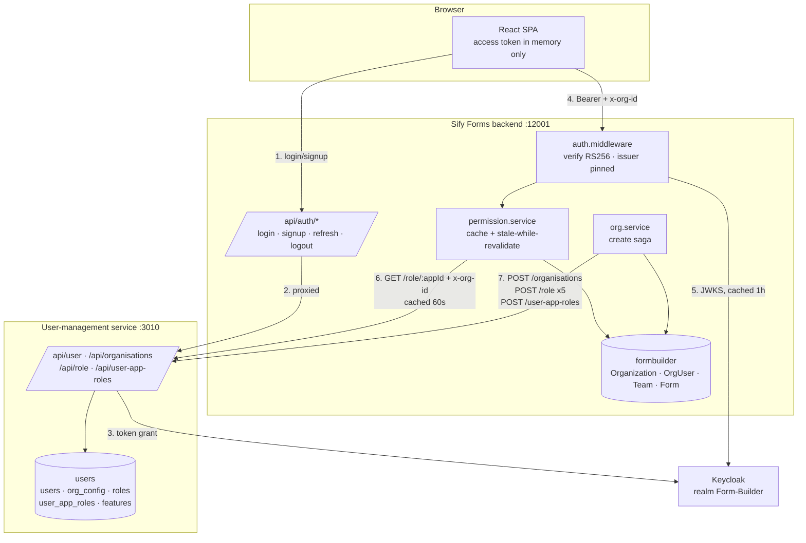

# Sify Forms ↔ User-Management Service Integration Plan

**Status:** Proposed · **Owner:** Sify Forms backend · **Target:** Production
**Date:** 2026-09-03

Sify Forms must stop being a partially-integrated island and consume the shared
user-management service (`/data/services/usermanagement-service`, referred to
below as **UMS**) as the authority for **identity, organizations and role
definitions**, while remaining the authority for everything that is actually
about forms.

This document is written against the *live* state of both systems, verified on
2026-09-03 by reading both codebases and querying both MySQL schemas. Every
claim below is evidence-backed; nothing is assumed.

---

## 0. Executive summary

Three things are true right now and they drive the whole plan:

1. **The integration is currently broken in production-blocking ways.** UMS has
   `usesOrgs = 1` for `Form-Builder`, which makes `x-org-id` *mandatory* on
   every `/api/role` call. [backend/src/service/rbac.client.ts](backend/src/service/rbac.client.ts)
   never sends it. Every `requirePermission()` route therefore fails. See §3.1.
2. **The token verification path is exploitable.** The backend fetches JWKS from
   the issuer *named inside the untrusted token*. Anyone who controls any
   Keycloak realm can mint a token that authenticates as any Sify Forms user.
   See §4.1. This must be fixed before anything ships.
3. **The data is a clean slate, so there is no migration risk.** `Organization`,
   `OrgUser`, `Team`, `Form` are all empty, `roles`/`org_config`/`user_app_roles`
   in UMS are all empty, and the two `User` tables already hold *identical* IDs.
   This is the cheapest possible moment to do this work.

The plan is five phases, ordered so that each one leaves the system working.

| Phase | Outcome | Risk if skipped |
| --- | --- | --- |
| 0 · Configure & seed | UMS knows about Form-Builder features/roles | Nothing else can run |
| 1 · Identity & auth hardening | Login/signup via UMS, issuer-pinned tokens, JIT provisioning | Auth bypass, orphaned accounts |
| 2 · Organizations | Org creation writes to UMS + Keycloak group | Orgs invisible to other Sify apps |
| 3 · Roles & permissions | Per-org role definitions read from UMS, outage-resilient | App dies when UMS blinks |
| 4 · Assignment mirroring | UMS sees who holds which role | Cross-app admin screens are wrong |
| 5 · Frontend | Single auth entry point, cookie-based refresh | XSS token theft |

---

## 1. Verified current state

### 1.1 User-management service

| Property | Value | Source |
| --- | --- | --- |
| Path | `/data/services/usermanagement-service` | — |
| Stack | Express 4 + TypeScript, `mysql2/promise`, `jsonwebtoken`, `jwks-rsa` | `package.json` |
| Port | `3010` | `.env` |
| API base | `/api` | `src/index.ts` |
| Database | MySQL schema **`users`** on `127.0.0.1:3306` | `src/dbconnection/mysql.ts` |
| Prod URL | `https://apidev.sifymodernization.digital/user-mgt` | [backend/pm2.config.js](backend/pm2.config.js) |

**Registered application (live row in `users.app_auth_config`):**

```
appId    : Form-Builder
appName  : Form-Builder
provider : keycloak
clientId : Form-Builder
isActive : 1
usesOrgs : 1        ← drives everything in §3.1
config   : {"realm":"Form-Builder","baseUrl":"http://1.6.37.35/keycloak",
            "adminUsername":"admin","adminPassword":"admin"}
```

**Live row counts in `users` schema:**

```
users           2      app_users       2      app_org_users   0
roles           0      user_app_roles  0      features        0
org_config      0      groups          0
```

**Actual `users.users` columns** (note: the column is `email`, *not* `emailId` —
this matters, see §4.6):

```
id, email, username, firstName, lastName, phone,
address, gender, additionalDetails (json), createdAt, updatedAt
```

**Key constraints that shape the design:**

```sql
-- roles
UNIQUE KEY uk_role_name_appId_orgId (name, appId, orgId)   -- orgId NULLable
FOREIGN KEY (appId) REFERENCES app_auth_config(appId)

-- user_app_roles
UNIQUE KEY uk_user_app_role (userId, appId, orgId)         -- exactly ONE role
                                                           -- per user per org
-- org_config
UNIQUE KEY unique_org_app (orgId, appId)
```

`user_app_roles` allowing exactly one role per user per org is a perfect match
for Sify Forms' `OrgUser.role`, which is also singular. No impedance mismatch.

### 1.2 Sify Forms

| Property | Value |
| --- | --- |
| Backend | Express + Prisma, port `12001`, [backend/src/index.ts](backend/src/index.ts) |
| Frontend | Vite/React, port `12000` |
| Database | MySQL schema **`formbuilder`** on the same instance |
| Auth today | Verifies Keycloak RS256 directly, [backend/src/middleware/auth.middleware.ts](backend/src/middleware/auth.middleware.ts) |
| RBAC today | Partial UMS client, [backend/src/service/rbac.client.ts](backend/src/service/rbac.client.ts) |

**Live row counts in `formbuilder`:**

```
User 2   Organization 0   OrgUser 0   OrgInvite 0
Team 0   TeamMember   0   Form      0   FormShare 0   Submission 0
```

**The two `User` tables already agree.** Same IDs, same emails:

```
0b1e491a-1008-437d-9731-e4fdc13ba720   testuu@gmail.com
a79c0ea4-8924-4647-b2ab-d75731b0a524   anupama.jeyashree@sifycorp.com
```

Both are the Keycloak `sub`. Both users are in `app_users` for `Form-Builder`.
**Identity is already unified** — the plan only has to keep it that way.

---

## 2. Ownership model (the decision that everything follows)

Ambiguous ownership is what makes two-service setups rot. Fix it once, here.

| Concept | System of record | Sify Forms holds | Sync direction |
| --- | --- | --- | --- |
| **Credentials / password** | Keycloak (realm `Form-Builder`) | nothing | n/a |
| **User identity** (id, email, name) | UMS `users` + Keycloak | `User` as a read-only projection | UMS → Forms (JIT on login) |
| **App membership** (`app_users`) | UMS | nothing | UMS only |
| **Organization identity** (id, name, active) | UMS `org_config` + Keycloak group | `Organization` (+ forms-specific fields: `slug`, `logo`, `industry`) | Forms → UMS at create |
| **Role definitions** (what ADMIN may do) | **UMS `roles`** | cached copy only | UMS → Forms (read + cache) |
| **Role assignments** (who is ADMIN) | **Sify Forms `OrgUser`** | authoritative | Forms → UMS `user_app_roles` (best-effort mirror) |
| **Teams, forms, shares, submissions** | Sify Forms | authoritative | never leaves |

**Why assignments stay local.** `OrgUser` is transactionally joined to
`OrgInvite` acceptance, team defaults and org deletion cascades. Moving it
across a network boundary turns a single local write into a distributed
transaction on the hottest write path in the product, and makes Sify Forms
unable to authorize *anything* when UMS is unavailable. UMS still gets the truth
via the mirror in Phase 4, which is what cross-app admin screens need — they
need visibility, not authority.

**The single identifier rule.** One value, three places:

```
formbuilder.Organization.id  ==  users.org_config.orgId  ==  x-org-id header
   (cuid, immutable)              (VARCHAR(255))              (already sent by
                                                               the frontend)
```

Do **not** use `Organization.slug` — it is user-editable and would break the
link on rename. `Organization.id` is a cuid, immutable, and the frontend already
puts exactly this value in `x-org-id`
([src/lib/api.ts](src/lib/api.ts#L41-L43)). No mapping table is ever needed.

---

## 3. Blocking defects to fix (P0 — functional)

### 3.1 `x-org-id` is mandatory but never sent → all permission checks fail

`orgResolver()` in UMS (`src/middleware/orgResolver.ts`):

```ts
if (usesOrgs && !orgId) {
    res.status(400).json({ error: `x-org-id header is required for app '${appAuth.appId}'` });
    return;
}
```

and it is mounted on every role route (`src/route/roleRoutes.ts`):

```ts
router.get('/:appId', authMiddleware, appAuthResolver(), orgResolver(), getAllRolesForApplication);
router.post('/',      authMiddleware, appAuthResolver(), orgResolver(), createRole);
router.put('/:id',    authMiddleware, appAuthResolver(), orgResolver(), updateRole);
```

`Form-Builder` has `usesOrgs = 1`. The Sify Forms client sets only
`x-app-id` ([backend/src/service/rbac.client.ts](backend/src/service/rbac.client.ts#L42-L49)),
so `listRoles()` gets a `400`, `fail()` converts it to a thrown error, and
`getEffectivePermissions()` throws. **Every route guarded by
`requirePermission()` is dead** — org read, member list, team CRUD, form create,
response export.

It also means `npm run rbac:seed` cannot create a single role, which is why
`users.roles` has 0 rows.

**Fix:** send `x-org-id` on every role call, and register orgs in `org_config`
first (Phase 0 + Phase 2 + Phase 3).

### 3.2 Org-scoped queries hide app-level roles

`src/dao/mysql/roleDao.ts`:

```ts
let baseQuery = ` FROM roles WHERE 1=1 AND appId = ? `;
if (orgId) { baseQuery += ` AND orgId = ?`; params.push(orgId); }
baseQuery += ` AND isActive = 1`;
```

`AND orgId = ?` never matches `orgId IS NULL`. So while `usesOrgs = 1`, roles
defined at app level are **unreachable**. Seeding five global role templates and
expecting every org to see them will silently return an empty list.

**Consequence:** role definitions must be materialised **per organization**.
This is not merely a workaround — Sify Forms already exposes per-org custom
roles (`POST /orgs/:orgId/roles` behind `MANAGE_ROLES`), so org-scoped role rows
are the correct model. See §7.

### 3.3 Deactivating a role silently strips all permissions

`getAllRolesForApplication` filters `isActive = 1`. If an admin deactivates
`ANALYST`, `findDefinition()` in
[backend/src/service/permission.service.ts](backend/src/service/permission.service.ts#L70-L82)
logs a warning and contributes **zero** actions. Every ANALYST is instantly
reduced to no permissions with no error surfaced anywhere a human will see.

**Fix:** block deactivation of a role that still has assignments
(`SELECT COUNT(*) FROM OrgUser WHERE roleId = ?`), and surface an explicit
`503 role definition unavailable` rather than a silent empty action set.

### 3.4 Signup is an unguarded dual write → permanently broken accounts

[src/store/authSlice.ts](src/store/authSlice.ts#L22) calls UMS
`POST /api/user/` (creates Keycloak user + `users` row + `app_users` row), then
separately calls Sify Forms `POST /api/auth/register`. If the second call fails
— network blip, validation error, user closes the tab — the account exists in
Keycloak and UMS but not in `formbuilder.User`. The user can then log in
successfully and receive a valid token, but
[backend/src/middleware/auth.middleware.ts](backend/src/middleware/auth.middleware.ts#L90-L100)
returns `401 User not found` **forever**, with no recovery path and no way for
the user to re-register (`Email already registered`).

**Fix:** JIT provisioning (§6.3) plus a single backend-owned signup saga (§6.2).

### 3.5 `RBAC_SERVICE_TOKEN` is a Keycloak access token, so it expires

`RBAC_SERVICE_TOKEN=` is empty in [.env](.env) and is used as the credential for
`npm run rbac:seed` and any background job
([backend/src/service/rbac.client.ts](backend/src/service/rbac.client.ts#L64-L67)).
A Keycloak access token lives minutes. Pasting one into `.env` produces a seed
script that works once and then fails, and background jobs that fail
non-deterministically.

**Fix:** Keycloak `client_credentials` service account (§6.5).

---

## 4. Security findings (P0/P1 — must be closed before production)

### 4.1 🔴 P0 · Authentication bypass via attacker-controlled JWKS

[backend/src/middleware/auth.middleware.ts](backend/src/middleware/auth.middleware.ts#L71-L84):

```ts
const decoded = jwt.decode(token, { complete: true }) as any;   // UNTRUSTED
const isKeycloak = decoded.header?.alg === 'RS256' && !!decoded.payload?.iss;
payload = await verifyKeycloakToken(token, decoded.payload.iss); // ← issuer from
                                                                 //   the token
```

`getJwksClient(issuer)` then fetches `${issuer}/protocol/openid-connect/certs`.

An attacker stands up any OIDC issuer, signs a token with
`sub = <victim user id>` and `iss = https://attacker.example/realms/x`, and the
backend dutifully downloads the attacker's public key, verifies the signature
successfully, and authenticates as the victim. There is no `iss` allowlist, no
`aud` check and no `azp` check. It is simultaneously a server-side request
forgery primitive.

The same pattern exists in UMS `src/middleware/authorization.ts`
(`resolveJwksUri` step 3 derives the JWKS URI from `decodeTokenUnsafe(token).iss`).

**Fix (both services):**

```ts
const EXPECTED_ISSUER = `${process.env.KEYCLOAK_BASE_URL}/realms/${process.env.KEYCLOAK_REALM}`;

jwt.verify(token, getKey, {
  algorithms: ['RS256'],           // never accept alg from the header
  issuer: EXPECTED_ISSUER,         // pin it
  audience: process.env.KEYCLOAK_AUDIENCE,
  clockTolerance: 5,
});
// then additionally assert payload.azp === KEYCLOAK_CLIENT_ID
```

Build the JWKS URI **only** from configuration. Never from the token.

### 4.2 🔴 P0 · `POST /app-auth-config` is unauthenticated

`src/route/appAuthConfigRoute.ts` in UMS mounts the create handler with no
middleware. Anyone who can reach the service can register or overwrite an
application's auth configuration — including `clientSecret` and the Keycloak
`adminUsername`/`adminPassword` in the `config` JSON. Combined with §4.1 this is
a full compromise of every app that trusts UMS.

**Fix:** require `authMiddleware` + a platform-superadmin check; move the route
behind an internal-only network path.

### 4.3 🔴 P0 · Keycloak admin credentials stored in plaintext, and they are `admin/admin`

Live row in `app_auth_config.config`:

```json
{"realm":"Form-Builder","baseUrl":"http://1.6.37.35/keycloak",
 "adminUsername":"admin","adminPassword":"admin"}
```

Three problems: default credentials, plaintext at rest, and plaintext `http://`
to the Keycloak admin API so the admin password crosses the network in the
clear.

**Fix:** rotate the Keycloak admin credential; use a dedicated realm-management
service account instead of the master admin; encrypt `clientSecret` and
`adminPassword` at rest (envelope encryption, key from a secrets manager, not
`.env`); force `https://` for `baseUrl`.

### 4.4 🟠 P1 · Secrets committed to `.env`

[.env](.env) currently contains a live DB password, `DMS_API_KEY`,
`AI_API_KEY`, and `JWT_SECRET="your-super-secret-jwt-key-change-in-production"`.
Treat every one of these as compromised.

**Fix:** rotate all of them before go-live; load from a secrets manager or
PM2/systemd environment injection; add `.env` to `.gitignore` and scrub history;
delete `JWT_SECRET` outright — the backend only accepts Keycloak RS256 tokens,
so it signs nothing and the variable is dead weight that invites misuse.

### 4.5 🟠 P1 · UMS `cors({ origin: '*' })` and no rate limiting on login

`src/index.ts` allows every origin. `POST /api/user/login` has no throttle,
making credential stuffing free.

**Fix:** explicit origin allowlist driven by `app_auth_config.appUrl`;
`express-rate-limit` on `/user/login`, `/user/forgot-password`,
`/user/refresh-token` keyed on IP **and** email; Keycloak brute-force detection
enabled on the realm.

### 4.6 🟡 P2 · UMS sets `req.user.email` from a column that does not exist

`src/middleware/authorization.ts`:

```ts
req.user = { id: user.id, email: user.emailId, username: user.username };
```

The live column is `email`, so `req.user.email` is always `undefined`. Harmless
today because nothing downstream reads it — a latent bug that will bite the
first handler that does.

### 4.7 🟠 P1 · Tokens in `localStorage`

[src/lib/api.ts](src/lib/api.ts#L35-L39) reads `localStorage.token`; the refresh
token is stored the same way. Any XSS — and this app renders user-authored form
schemas — exfiltrates a long-lived refresh token.

**Fix:** Phase 5. Refresh token becomes an `httpOnly; Secure; SameSite=Strict`
cookie issued by the Sify Forms backend proxy. The access token stays in memory
only (a module variable in the Redux store, never persisted).

---

## 5. Target architecture



**Request-path cost.** Steps 4–6 are the hot path. Token verification is local
(JWKS cached one hour). Role definitions are cached 60s per `(appId, orgId)`.
Assignment lookup is a local indexed Prisma read. **Steady state: zero network
calls to UMS per request.** Only the first request per org per minute pays a
single ~5 ms call.

---

## 6. Phase 1 — Identity and authentication

### 6.1 Pin the issuer (do this first, it is the P0)

Rewrite `verifyKeycloakToken` in
[backend/src/middleware/auth.middleware.ts](backend/src/middleware/auth.middleware.ts)
so the JWKS URI comes from config only, and add `issuer` / `audience` /
`algorithms` options as in §4.1. Reject any token whose `iss` is not exactly
`${KEYCLOAK_BASE_URL}/realms/${KEYCLOAK_REALM}`.

Delete the `req.cookies?.token` fallback on the *access* token — with the cookie
strategy in Phase 5, only the refresh token lives in a cookie, and accepting an
access token from a cookie reintroduces CSRF exposure on every state-changing
route.

### 6.2 Move signup behind one backend endpoint

`POST /api/auth/register` becomes a saga owned by the backend:

```
1. Validate payload (SignUpSchema, extended with `password`)
2. POST {UMS}/api/user  with x-app-id: Form-Builder
      → creates Keycloak user + users row + app_users row
      → returns the Keycloak sub as `userDetails.id`
3. INSERT formbuilder.User { id: <sub>, email, firstName, lastName, ... }
4. On step-3 failure: compensate — DELETE the Keycloak user, log the
   compensation, return 500. Never leave step 2 dangling.
5. Return 201 with no tokens. The client then logs in normally.
```

The frontend drops its direct `keycloakApi.post('/user/', ...)` call. One
network call, one owner, one failure mode.

### 6.3 JIT provisioning closes the orphan hole permanently

Even with a correct saga, accounts created by other Sify apps or directly in
Keycloak will not exist in `formbuilder.User`. In `authMiddleware`, when the
token verifies but the local user is missing, **create the row from verified
token claims** instead of returning 401:

```ts
user = await prisma.user.upsert({
  where:  { id: payload.sub },
  update: {},                               // never overwrite local edits
  create: {
    id:        payload.sub,
    email:     payload.email,
    firstName: payload.given_name  ?? null,
    lastName:  payload.family_name ?? null,
    username:  payload.preferred_username ?? null,
  },
  select: { id: true, email: true, firstName: true, lastName: true, username: true },
});
```

Guard it: only provision when the token carries a verified `email` claim
(`email_verified === true` if the realm sets it). This is safe because the token
signature has already been validated against the pinned issuer.

### 6.4 Login proxy

`POST /api/auth/login` on the Sify Forms backend forwards to
`POST {UMS}/api/user/login` with `x-app-id: Form-Builder`, then:

- sets the refresh token as `httpOnly; Secure; SameSite=Strict; Path=/api/auth`
  cookie,
- returns `{ accessToken, expiresIn, user }` in the body,
- applies rate limiting (5 attempts / 15 min per IP+email),
- triggers JIT provisioning so the local row exists before the first API call.

`POST /api/auth/refresh` reads the cookie, calls
`POST {UMS}/api/user/refresh-token`, rotates the cookie.
`POST /api/auth/logout` calls `POST {UMS}/api/user/logout` and clears the cookie.

### 6.5 Service account for machine-to-machine calls

Replace `RBAC_SERVICE_TOKEN` with a Keycloak `client_credentials` grant:

```
KEYCLOAK_SERVICE_CLIENT_ID=form-builder-svc
KEYCLOAK_SERVICE_CLIENT_SECRET=<from secrets manager>
```

Add a small token provider in `rbac.client.ts` that fetches
`/realms/Form-Builder/protocol/openid-connect/token` with
`grant_type=client_credentials` and caches the token until 30 s before `exp`.

⚠️ **Dependency on the UMS team:** UMS `authMiddleware` requires the token's
`email` to resolve to a row in `users` *and* in `app_users`. A service account
token has no `email` claim. Two options — pick one before Phase 3:

- **(a)** UMS adds a service-account branch: accept tokens whose `azp` is in a
  configured allowlist, skipping the email lookup. Cleanest.
- **(b)** Create a real service user (`svc-form-builder@sify.internal`) in the
  realm with a protocol mapper injecting the `email` claim into the
  client-credentials token, and register it in `users` + `app_users`. Requires
  no UMS code change.

Option (b) unblocks Sify Forms without touching UMS and is the recommended
starting point; (a) is the follow-up.

---

## 7. Phase 2 — Organizations created through UMS

### 7.1 Sequence

```mermaid
sequenceDiagram
    participant FE as Frontend
    participant FB as Forms backend
    participant DB as formbuilder
    participant UM as UMS
    participant KC as Keycloak

    FE->>FB: POST /api/orgs {name, slug, industry}
    FB->>DB: INSERT Organization (status=PROVISIONING)  → id (cuid)
    FB->>UM: POST /api/organisations {appId, orgId:<cuid>, name}
    UM->>KC: create group "<cuid>"
    UM-->>FB: 201
    FB->>UM: POST /api/role ×5  (x-org-id: <cuid>)  → 5 role ids
    FB->>DB: INSERT OrgUser (userId, role=OWNER, roleId=<owner role id>)
    FB->>UM: POST /api/organisations/<cuid>/members {userId}
    FB->>UM: POST /api/user-app-roles {userId, roleId, appId, orgId}
    FB->>DB: INSERT Team "General"; Organization.status = ACTIVE
    FB-->>FE: 201 {org}
```

### 7.2 Making it safe

There is no distributed transaction available, so the design must tolerate
failure at every arrow.

- **Local first, remote second.** The cuid must exist before UMS can be told
  about it. Add `Organization.provisioningStatus` (`PROVISIONING | ACTIVE |
  FAILED`) and have `orgMiddleware` reject non-`ACTIVE` orgs with `409 org is
  still being provisioned`. A half-built org is never usable.
- **Compensate on failure.** If `POST /organisations` fails, delete the local
  `Organization` row and return the UMS error verbatim. The user retries with
  the same slug and nothing is stranded.
- **Idempotency.** UMS returns a duplicate error on re-create; treat
  "already exists" as success. Every step in the saga must be safe to re-run so
  a resume job can finish a `FAILED` org.
- **Resume job.** A small script (`npm run org:reconcile`) that finds
  `provisioningStatus != 'ACTIVE'` orgs and replays the remaining steps. Run it
  on boot and on a schedule.

### 7.3 Field mapping

| formbuilder.Organization | users.org_config | Note |
| --- | --- | --- |
| `id` (cuid) | `orgId` | the join key, and the `x-org-id` value |
| `name` | `name` | mirrored on update (`PATCH` is toggle-only in UMS today, so name changes stay local until UMS adds an update endpoint) |
| `slug`, `logo`, `industry` | — | forms-only, never sent |
| — | `appId` | always `Form-Builder` |
| — | `isActive` | UMS-owned; mirror into `orgMiddleware` on a slow path |

`slug` stays the human-facing URL segment for public forms
(`/forms/public/:orgSlug/:formSlug`) and stays purely local, so renaming an org
never touches UMS.

### 7.4 Deletion

UMS refuses to delete an org that still has members, roles, features or
assignments. So `DELETE /orgs/:orgId` must unwind in order: local cascade →
`DELETE /user-app-roles` per member → `DELETE /organisations/:orgId/members/:userId`
per member → deactivate the 5 roles → `DELETE /organisations/:id`. Do this in a
background job with retries, not inline on the request; mark the org
`provisioningStatus = DELETING` immediately so it disappears from the UI at once.

---

## 8. Phase 3 — Roles and permissions

### 8.1 Per-org role materialisation

Because of §3.2, each org gets its own copy of the five role definitions
(`OWNER`, `ADMIN`, `CREATOR`, `ANALYST`, `VIEWER`) from
[backend/src/config/rbac.config.ts](backend/src/config/rbac.config.ts), written
with `x-org-id` set. `uk_role_name_appId_orgId` guarantees uniqueness per org.

This is the correct model, not a compromise: Sify Forms already ships
`POST /orgs/:orgId/roles` behind `MANAGE_ROLES`, so orgs are *expected* to
diverge. The seeded five are the starting template, not a global constant.

Cost is bounded — 5 rows per org, one-time, on the rarest write in the product.
At 1,000 orgs that is 5,000 rows in a table read through a 60-second cache.

### 8.2 Client changes

In [backend/src/service/rbac.client.ts](backend/src/service/rbac.client.ts):

- Add `orgId` to every role call and send `x-org-id`.
- Key the role cache on `` `${appId}|${orgId}` `` instead of a single global
  slot — today one org's roles would be served to another, which is a
  cross-tenant authorization defect the moment a second org exists.
- Never send `x-org-id` on calls to `/feature/*` if features stay app-level —
  but note `orgResolver` will reject that too while `usesOrgs = 1`, so features
  must also be seeded per org, or hoisted out. Seed them per org for now.

### 8.3 Surviving a UMS outage (non-negotiable for production)

Today, if UMS returns anything other than 200, `fail()` throws and **the entire
application stops authorizing requests**. Role definitions change perhaps
monthly; taking Sify Forms down for them is indefensible.

Layer three defences in `listRoles()`:

1. **Stale-while-revalidate.** On fetch failure, if a cached copy exists, serve
   it regardless of age, log at `warn`, and schedule a retry with backoff.
2. **Persisted last-known-good.** Write each successful fetch to a local
   `RoleDefinitionCache` table (`appId`, `orgId`, `payload` JSON, `fetchedAt`).
   On cold start with UMS down, load from there. Without this, a restart during
   an outage is a full outage.
3. **Circuit breaker.** After N consecutive failures, stop calling for 30 s.
   Prevents a slow UMS from exhausting the Node event loop through 5-second
   timeouts on every request.

Escalate to `503 Service Unavailable` (never `403`) only when all three miss —
a `403` here would train users to think their permissions were revoked.

### 8.4 Permission service changes

[backend/src/service/permission.service.ts](backend/src/service/permission.service.ts)
needs only:

- pass `orgId` into `listRoles(orgId)`,
- distinguish "role definition genuinely absent" (→ 503, do not cache) from
  "user has no membership" (→ empty actions, cacheable),
- keep the existing 30 s `(user, org)` cache and the existing
  `invalidatePermissions()` calls on every membership change. That part is
  already correct.

---

## 9. Phase 4 — Mirroring assignments to UMS

After every successful local assignment change (`createOrg`, invite accept,
`updateOrgUserRole`, `removeOrgUser`), enqueue a mirror:

| Local event | UMS call |
| --- | --- |
| member added | `POST /api/organisations/:orgId/members` then `POST /api/user-app-roles` |
| role changed | `PUT /api/user-app-roles/:userId/:appId` (+ `x-org-id`) |
| member removed | `DELETE /api/user-app-roles/:userId/:appId` then `DELETE /api/organisations/:orgId/members/:userId` |

Rules that keep this from becoming a liability:

- **Never fail the user's request on mirror failure.** Log, enqueue, return 200.
- **Use a durable queue**, not `setTimeout`. A `MirrorOutbox` table written in
  the *same Prisma transaction* as the membership change is the simplest
  correct option — the transactional-outbox pattern — and needs no new
  infrastructure.
- **Reconcile nightly.** `npm run rbac:reconcile` diffs `OrgUser` against
  `user_app_roles` per org and repairs drift. Report the diff count as a metric;
  a non-zero trend means the outbox is broken.

---

## 10. Phase 5 — Frontend

| Change | File | Why |
| --- | --- | --- |
| Delete `keycloakApi` entirely; all auth through `api` | [src/lib/api.ts](src/lib/api.ts) | one origin, one interceptor, no `x-app-id` leaked to the browser |
| Access token in memory (module variable), not `localStorage` | [src/lib/api.ts](src/lib/api.ts), [src/store/authSlice.ts](src/store/authSlice.ts) | §4.7 |
| Refresh via `POST /api/auth/refresh` with `withCredentials: true` | [src/lib/api.ts](src/lib/api.ts#L106) | refresh token never reachable from JS |
| Signup calls only `POST /api/auth/register` | [src/store/authSlice.ts](src/store/authSlice.ts#L22) | §3.4 |
| Profile update calls only `PUT /api/auth/profile`; backend forwards to UMS | [src/store/authSlice.ts](src/store/authSlice.ts#L112) | removes the second dual-write |
| Keep `x-org-id` interceptor and `rotateOrganizationRequestScope()` unchanged | [src/lib/api.ts](src/lib/api.ts#L27-L43) | already correct; the abort-on-switch guard prevents cross-org data bleed |
| Handle `409 provisioning` on the org switcher | [src/components/layout/OrgSwitcher.tsx](src/components/layout/OrgSwitcher.tsx) | §7.2 |

On page load with no access token in memory, the app calls
`POST /api/auth/refresh` once. If it succeeds the session resumes silently; if
it fails, redirect to login. This replaces the current "read `localStorage` and
hope" bootstrap.

---

## 11. Phase 0 — Prerequisites (run these first)

### 11.1 Environment

Sify Forms [.env](.env) — add / change:

```diff
+KEYCLOAK_REALM=Form-Builder
+KEYCLOAK_AUDIENCE=Form-Builder
+KEYCLOAK_CLIENT_ID=Form-Builder
+KEYCLOAK_SERVICE_CLIENT_ID=form-builder-svc
+KEYCLOAK_SERVICE_CLIENT_SECRET=<secrets manager>
 RBAC_SERVICE_URL=http://localhost:3010
 RBAC_APP_ID=Form-Builder
-RBAC_SERVICE_TOKEN=
 RBAC_CACHE_TTL_MS=30000
+RBAC_ROLE_CACHE_TTL_MS=60000
+RBAC_TIMEOUT_MS=5000
+RBAC_BREAKER_THRESHOLD=5
-JWT_SECRET="your-super-secret-jwt-key-change-in-production"
```

Note `RBAC_APP_ID=Form-Builder` already matches the live `app_auth_config.appId`
exactly — including the hyphen. Do not "correct" it to `FormBuilder`; the
foreign key from `roles.appId` would break.

Also reconcile the Keycloak base URL: [.env](.env) says
`https://apidev.sifymodernization.digital` while `app_auth_config.config.baseUrl`
says `http://1.6.37.35/keycloak`. **They must agree**, or issuer pinning (§4.1)
will reject every token. Decide on the public HTTPS hostname and update the DB
row.

UMS `.env` — confirm `PORT=3010`, `MYSQL_DB=users`, and add rate-limit and CORS
allowlist settings.

### 11.2 Register features and roles

Once §6.5 gives the seed script a working credential and Phase 2 creates at
least one org, run:

```bash
cd backend && npm run rbac:seed
```

[backend/src/scripts/seedRbac.ts](backend/src/scripts/seedRbac.ts) must first be
updated to accept an `--org <orgId>` argument and send `x-org-id`, per §3.1.
Verify:

```bash
curl -H "x-app-id: Form-Builder" \
     -H "x-org-id: <orgId>" \
     -H "Authorization: Bearer <token>" \
     http://localhost:3010/api/role/Form-Builder
```

Expect five roles with populated `permission.privilege` arrays covering all 27
actions in `ACTIONS`.

---

## 12. Test plan

| # | Scenario | Expected |
| --- | --- | --- |
| 1 | Token signed by a foreign issuer | `401` — no outbound JWKS fetch to the foreign host |
| 2 | Token with `alg: none` or HS256 | `401` |
| 3 | Expired token | `401`, then transparent refresh via cookie |
| 4 | Signup, kill the backend between UMS create and local insert | Keycloak user removed by compensation, retry with same email succeeds |
| 5 | Login as a user present in Keycloak but absent from `formbuilder.User` | JIT-provisioned, request succeeds |
| 6 | Org create with UMS stopped | `Organization` row rolled back, clear error, no orphan |
| 7 | Org create where `POST /role` fails on role 3 of 5 | Org marked `FAILED`, `org:reconcile` completes it |
| 8 | Two orgs, user is OWNER in A and VIEWER in B | Permissions differ per `x-org-id`; **no cache bleed** (§8.2) |
| 9 | Stop UMS after a successful permission fetch | Requests keep working from stale cache; `warn` logged |
| 10 | Stop UMS **and** restart the backend | Requests keep working from `RoleDefinitionCache` |
| 11 | UMS returns 500 continuously | `503` after breaker opens, never `403` |
| 12 | Change a member's role | Local effective permissions change within 0 s (cache invalidated); `user_app_roles` updated within 60 s |
| 13 | Mirror call fails | User request still `200`; outbox row present; reconcile repairs it |
| 14 | Deactivate a role that has holders | Blocked with a clear error (§3.3) |
| 15 | `x-org-id` for an org the user does not belong to | `403` from `orgMiddleware`, no UMS call made |
| 16 | Rapid org switching | In-flight requests aborted; no data from the previous org renders |
| 17 | Public form submission (`POST /api/submissions`) | Unaffected — still anonymous and rate-limited |
| 18 | Load: 200 rps steady state | Zero UMS calls per request; p99 auth overhead < 5 ms |

Tests 1, 2, 8, 9, 10, 11 are the ones that would otherwise be discovered in
production.

---

## 13. Rollout

1. **Staging, UMS untouched.** Phases 0–3 with option (b) from §6.5. Verifies
   the whole design needs no UMS code change to function.
2. **Security fixes to UMS** (§4.1, §4.2, §4.3, §4.5) — coordinate with the UMS
   team; these protect every app on the platform, not just Sify Forms.
3. **Production, feature-flagged.** `UMS_ORG_SYNC_ENABLED` and
   `UMS_ROLE_MIRROR_ENABLED`. Off → current local-only behaviour (plus the
   security fixes, which are never flagged off). On → full integration.
4. **Rollback.** Because assignments and org content stay local and
   authoritative, disabling both flags returns Sify Forms to a fully working
   state with no data loss. Rows already written to UMS are harmless. This is
   the main reason the ownership split in §2 is drawn where it is.

Because both databases are effectively empty today, there is **no backfill
script and no migration window**. If this work is deferred until real customers
have created orgs, both become necessary.

---

## 14. Open questions for the UMS team

1. Will UMS support service-account tokens (§6.5 option a), or should Sify Forms
   use a mapper-backed service user (option b)?
2. `getAllRolesForApplication` filters `AND orgId = ?`, hiding app-level roles.
   Would UMS accept `AND (orgId = ? OR orgId IS NULL)`? That would let shared
   role templates coexist with per-org custom roles and remove the per-org
   cloning in §8.1.
3. `PATCH /organisations/:id` is a *toggle*, not a setter, and there is no
   endpoint to rename an org. Can a `PUT /organisations/:id` be added?
4. `POST /app-auth-config` is unauthenticated (§4.2) — who owns the fix?
5. Is there a plan for webhooks or an event stream from UMS (user deactivated,
   org deactivated)? Without one, Sify Forms can only discover deactivation on
   the next cache refresh, up to 60 s late.
6. Confirm the canonical Keycloak base URL (§11.1) — `1.6.37.35` over plaintext
   HTTP is not viable for production.

---

## Appendix A — File-by-file change list

| File | Phase | Change |
| --- | --- | --- |
| [backend/src/middleware/auth.middleware.ts](backend/src/middleware/auth.middleware.ts) | 1 | Pin issuer/audience/algorithms; JIT provisioning; drop access-token cookie fallback |
| [backend/src/routes/auth.routes.ts](backend/src/routes/auth.routes.ts) | 1 | Add `/login`, `/refresh`; keep `/register`, `/session`, `/profile`, `/logout` |
| [backend/src/service/auth.service.ts](backend/src/service/auth.service.ts) | 1 | Signup saga with compensation; profile forwarding to UMS |
| [backend/src/service/ums.client.ts](backend/src/service/ums.client.ts) | 1 | **New** — user/org endpoints + service-account token provider |
| [backend/src/service/rbac.client.ts](backend/src/service/rbac.client.ts) | 3 | `x-org-id` on all role calls; per-org cache key; stale-while-revalidate; circuit breaker |
| [backend/src/service/permission.service.ts](backend/src/service/permission.service.ts) | 3 | Thread `orgId`; 503 vs empty-actions distinction |
| [backend/src/service/org.service.ts](backend/src/service/org.service.ts) | 2 | Provisioning saga + compensation + deletion unwind |
| [backend/src/service/role.service.ts](backend/src/service/role.service.ts) | 3 | Block deactivating roles that have holders |
| [backend/src/scripts/seedRbac.ts](backend/src/scripts/seedRbac.ts) | 0 | `--org` flag, `x-org-id`, service-account credential |
| [backend/prisma/schema.prisma](backend/prisma/schema.prisma) | 2,3,4 | `Organization.provisioningStatus`; `RoleDefinitionCache`; `MirrorOutbox` |
| [src/lib/api.ts](src/lib/api.ts) | 5 | Remove `keycloakApi`; in-memory access token; cookie refresh |
| [src/store/authSlice.ts](src/store/authSlice.ts) | 5 | Single-call login/signup/profile |
| [.env](.env) | 0 | Per §11.1, plus rotation of every secret |
